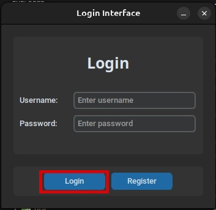
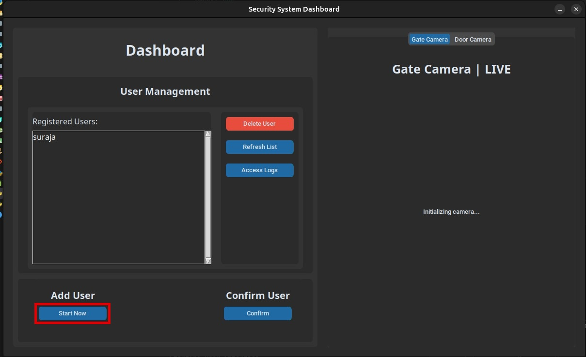
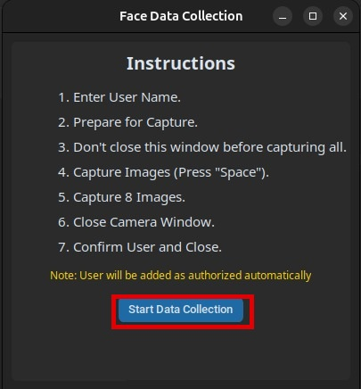
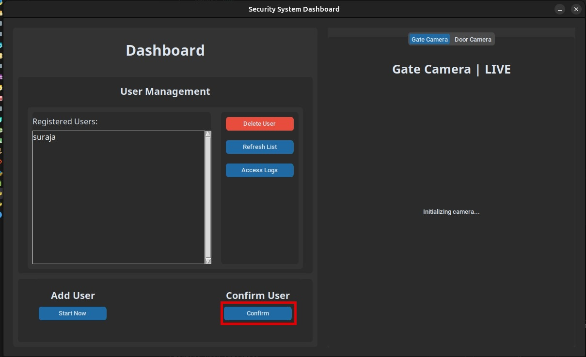
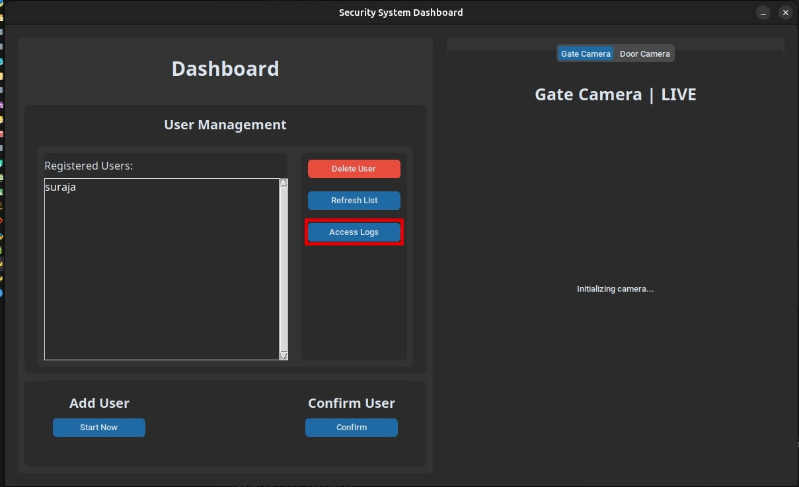
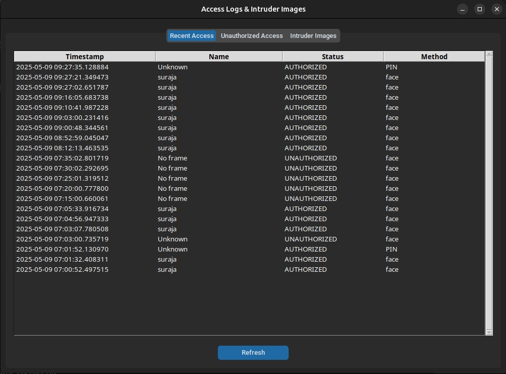

# Secure Access Surveillance System

A smart security system using facial recognition, running on Raspberry Pi with cloud integration and MQTT communication.

## Features

- Real-time facial recognition for authentication
- Multiple authentication methods (Face, PIN)
- Cloud storage for unauthorized access images using Cloudinary
- MQTT integration for remote monitoring and control
- SQLite database for access logs and user management
- Automated door lock/unlock mechanism
- Intruder detection and alerting system

## Prerequisites

- Raspberry Pi (3 or newer recommended)
- Ubuntu 20.04
- Webcam or camera module
- Python 3.7+
- Internet connection for cloud features
- MQTT broker (optional for remote monitoring)

## Development Environment Setup (Ubuntu 20.04)

1. Clone the repository:

```bash
git clone https://github.com/Smart-Home-Automation-System-Project/Secure-Access-Surveillance-System
cd Secure-Access-Surveillance-System
```

2. Set up a virtual environment:

```bash
python3 -m venv --system-site-packages venv
source venv/bin/activate
```

3. Update packages:

```bash
sudo apt update
sudo apt full-upgrade
```

4. Install dependencies in the virtual environment:

```bash
pip install -r requirements.txt
```

### References

- https://core-electronics.com.au/guides/raspberry-pi/face-recognition-with-raspberry-pi-and-opencv/
- https://www.youtube.com/watch?v=3TUlJrRJUeM&t=432s

## Configuration

Create .env file in the root directory with the following structure:

```python
# Cloudinary Configuration
CLOUDINARY_CLOUD_NAME=<your_cloud_name>
CLOUDINARY_API_KEY=<your_api_key>
CLOUDINARY_API_SECRET=<your_api_secret>

# MQTT Configuration
MQTT_BROKER_IP=<your_mqtt_broker_ip>
MQTT_BROKER_PORT=1883

# Stream Configuration
STREAM_HOST=0.0.0.0
STREAM_PORT=5000

# Firebase Configuration
FIREBASE_DATABASE_URL=<your_firebase_database_url>
```

### Cloudinary Configuration

1. Create a Cloudinary account and set up a new project.
2. Obtain the Cloudinary credentials (cloud name, API key, API secret) and update the `.env` file.

### Firebase Configuration

1. Create a Firebase project and enable the Realtime Database.
2. Download the service account key JSON file and place it in the `config/` directory.
3. Update the `.env` file with the Firebase database URL.

## Usage

1. Start the main system:

```bash
python main.py
```
or

```bash
chmod +x run.sh # Make the script executable
./run.sh
```

2. Select which Part of the system to run:

```bash
Select an option:
1. Open User Interface
2. Start Security Services
3. Exit
Enter your choice (1/2/3):
```

### User Interface

1. Login using username and password. (default: admin/1234)



2. After successful login, you will be redirected to the main page.



3. You can add a new user by clicking on the "Start Now" button under the "Add User" section. Then click on the "Start Data Collection" button to start capturing images for the new user.



4. After adding a user, click on the "Confirm" button under the "Confirm User" section to save the user details.



5. You can view the access logs and intruder images by clicking on the "Access Logs" button.





### Security Services

1. Start the security services by selecting option 2 in the main menu.

2. Available commands:

- `status`: Check door lock status
- `lock`: Manually lock the door
- `pin XXXX`: Unlock using PIN
- `exit` or `ctrl+c`: Stop the service

## Development

### Running Tests

```bash
python -m pytest test/
```

### Adding New Features

1. Create feature branch
2. Implement changes
3. Submit pull request

## Security Considerations

- Store sensitive configuration separately
- Use secure MQTT communication (TLS)
- Regularly update authorized users list
- Monitor access logs for unauthorized attempts
- Back up the database regularly

## Contributing

1. Fork the repository
2. Create feature branch
3. Commit changes
4. Push to branch
5. Submit pull request

## Acknowledgments

- Face recognition using [face_recognition](https://github.com/ageitgey/face_recognition)
- MQTT implementation with [paho-mqtt](https://github.com/eclipse/paho.mqtt.python)
- Cloud storage using [Cloudinary](https://cloudinary.com/)

chmod +x run_application.sh

./run_application.sh